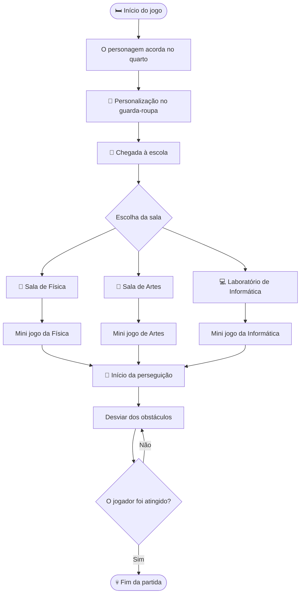

# Roteiro do Jogo — Infinite Sprint

Este documento apresenta o roteiro oficial do jogo **Infinite Sprint**, registrando a história, a sequência dos acontecimentos, as fases e as mecânicas planejadas para o desenvolvimento do projeto.

---

# 🎮 Visão geral

**Infinite Sprint** é um jogo de corrida infinita (*Infinite Runner*) em estilo **2D Pixel Art**, ambientado dentro de uma escola.

O jogador controla um estudante que, após escolher uma sala de aula, acaba sendo perseguido por um professor em uma sequência de desafios e obstáculos. Cada sala possui um mini jogo próprio que serve como introdução para a corrida principal.

---

# 📚 História do jogo

O jogo começa em uma manhã comum.

O personagem principal desperta em seu quarto e inicia sua rotina antes de ir para a escola. Após acordar, ele pode personalizar sua aparência escolhendo roupas e acessórios no guarda-roupa.

Com o personagem pronto, o jogador segue para a escola e escolhe uma das salas disponíveis para assistir à aula. No entanto, a aula rapidamente se transforma em uma perseguição inesperada, dando início ao desafio principal do jogo.

---

## 🗺️ Fluxo da história

---

# 🏫 Fases disponíveis

## 🧪 Sala de Física

### Introdução

O jogador entra na sala de Física e procura um lugar para sentar.

Existe apenas uma carteira disponível: **quinta coluna, quarta fileira**.

Depois que o personagem se senta, a professora Jessyca faz uma pergunta considerada muito difícil.

### Mini jogo

O jogador possui **3 segundos** para responder.

#### Resultado esperado

O jogador não responde ou responde incorretamente.

A professora inicia a perseguição imediatamente.

#### Resultado alternativo

Caso o jogador consiga responder corretamente, a professora diz:

> **"Sabichão aqui não tem vez!"**

Mesmo assim, a perseguição começa.

### Corrida principal

Durante a corrida:

* Professora Jessyca anda de cabeça para baixo (plantando bananeira).
* Arremessa pincéis de quadro utilizando os pés.
* O cenário possui obstáculos espalhados pela escola.

### Derrota

Quando o jogador é atingido:

* A professora quebra um pincel na cabeça do personagem.
* Surge a frase:

> **HEAD SHOT**

---

## 🎨 Sala de Artes

### Introdução

O jogador entra na sala e senta diante de um quadro de pintura.

O professor apresenta um desafio artístico.

### Mini jogo

O objetivo é pintar **A Noite Estrelada**, de Vincent van Gogh.

Tempo disponível:

**5 segundos.**

Como consequência do tempo curto, o desenho fica incompleto e muito diferente da pintura original.

### Fala do professor

> **"Que coisa horrível, está desrespeitando a arte?!"**

### Corrida principal

Durante a perseguição:

* O professor corre atrás do jogador.
* Boinas são lançadas durante o percurso como obstáculos.

### Derrota

Quando o jogador perde:

* O professor rasga uma boina na cabeça do personagem.

---

## 💻 Laboratório de Informática

### Introdução

O jogador entra no laboratório e senta em um computador.

O professor Roger pede para ligar o monitor.

### Mini jogo

O monitor possui vários botões.

O jogador tem **3 tentativas** para encontrar o botão correto.

#### Mecânica

* A posição do botão correto muda a cada nova partida.
* Enquanto o jogador permanecer na mesma partida, o botão correto continua na mesma posição.
* Caso as três tentativas acabem, o jogador perde pontos, mas pode continuar tentando.

### Segunda etapa

Depois de ligar o computador, o professor pede para desligar o monitor.

Ao tentar desligar, aparece a mensagem:

> **"Botão não está funcionando."**

O professor insiste:

> **"Desliga agora!"**

O jogador tenta novamente e continua sem conseguir.

Então o professor remove o monitor da mesa e diz:

> **"Vai desligar por bem ou por mal!"**

A perseguição começa.

### Corrida principal

Durante a corrida:

* O professor arremessa teclados.
* Também arremessa mouses pelo caminho.

### Derrota

Quando o jogador é atingido:

* O professor quebra o monitor na cabeça do personagem.

---

# 🏃 Mecânica principal da corrida

Independentemente da sala escolhida, todas as fases compartilham a mecânica principal do jogo.

## Objetivo

Sobreviver o maior tempo possível enquanto foge do professor da fase escolhida.

## Elementos da corrida

* Corrida contínua.
* Obstáculos espalhados pelo cenário.
* Objetos arremessados pelo professor.
* Sistema de pontuação por tempo sobrevivido e desempenho nos mini jogos.

## Condição de derrota

A partida termina quando o personagem é atingido durante a perseguição.

Cada fase possui uma animação e um encerramento próprios.

---

# 👨‍🏫 Professores e obstáculos

# 👨‍🏫 Professores e obstáculos

| **Sala**      | **Professor**          | **Obstáculos durante a perseguição** | **Derrota** |
|---------------|------------------------|--------------------------------------|-------------|
| 🧪 **Física** | Professora **Jessyca** | Pincéis de quadro arremessados com os pés enquanto anda de cabeça para baixo. | A professora quebra um pincel na cabeça do jogador e aparece a frase **"HEAD SHOT"**. |
| 🎨 **Artes** | Professor de **Artes** | Boinas arremessadas ao longo do percurso. | O professor rasga uma boina na cabeça do jogador. |
| 💻 **Laboratório de Informática** | Professor **Roger** | Teclados e mouses arremessados durante a corrida. | O professor quebra um monitor na cabeça do jogador. |

---

# 🎯 Mecânicas planejadas

* Tela inicial de login.
* Personalização do personagem no quarto.
* Escolha da sala de aula.
* Mini jogos exclusivos para cada fase.
* Corrida infinita com obstáculos diferentes em cada sala.
* Sistema de pontuação.
* Animações de derrota específicas para cada professor.

---

# 📌 Observações de desenvolvimento

Este roteiro representa a versão inicial da história do **Infinite Sprint**. Alterações em fases, personagens, diálogos ou mecânicas serão registradas neste documento conforme o desenvolvimento do projeto avançar.

**Status do roteiro:** ✅ Primeira versão oficial aprovada pela equipe.
